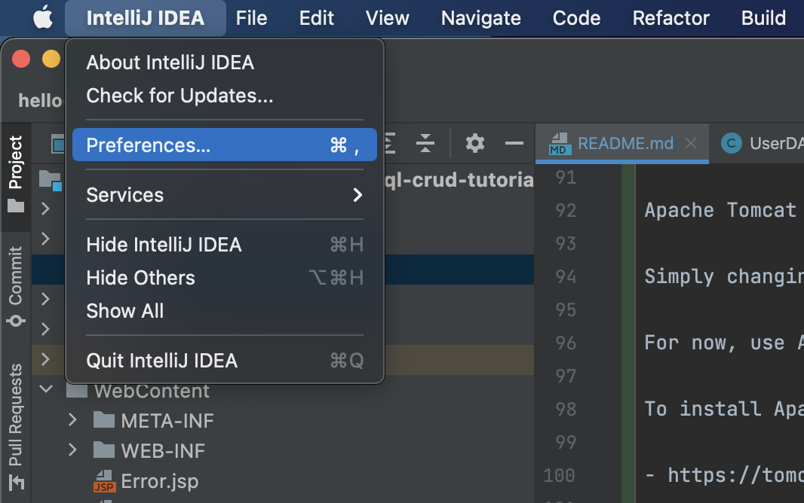
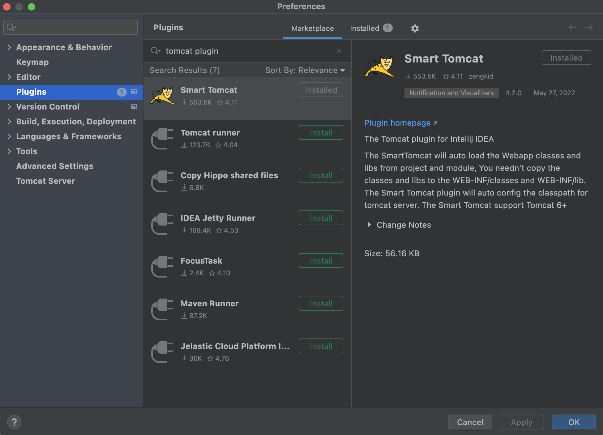
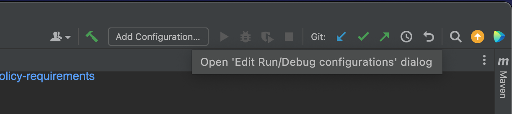
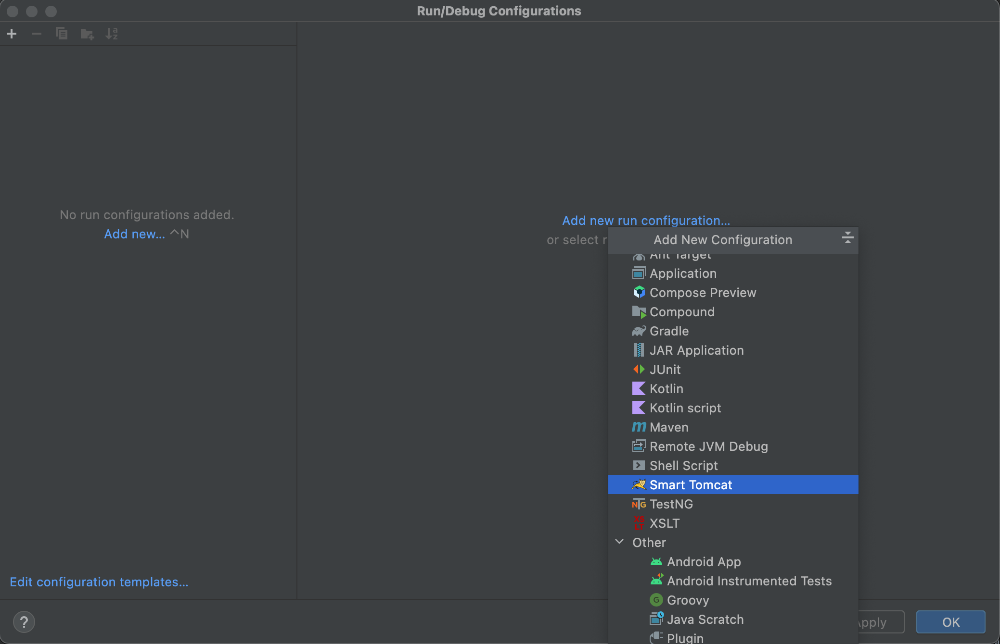
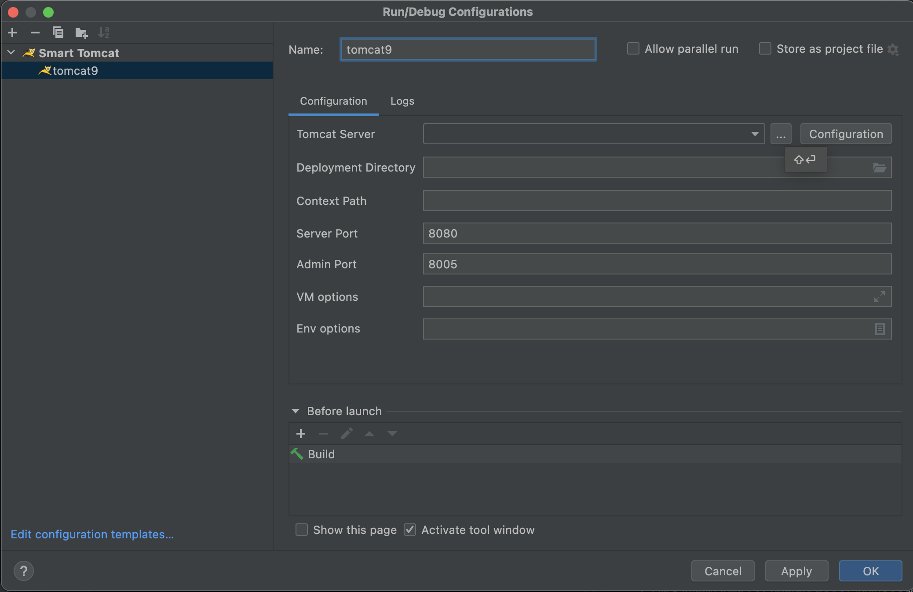
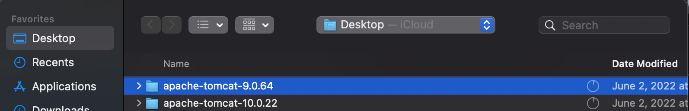
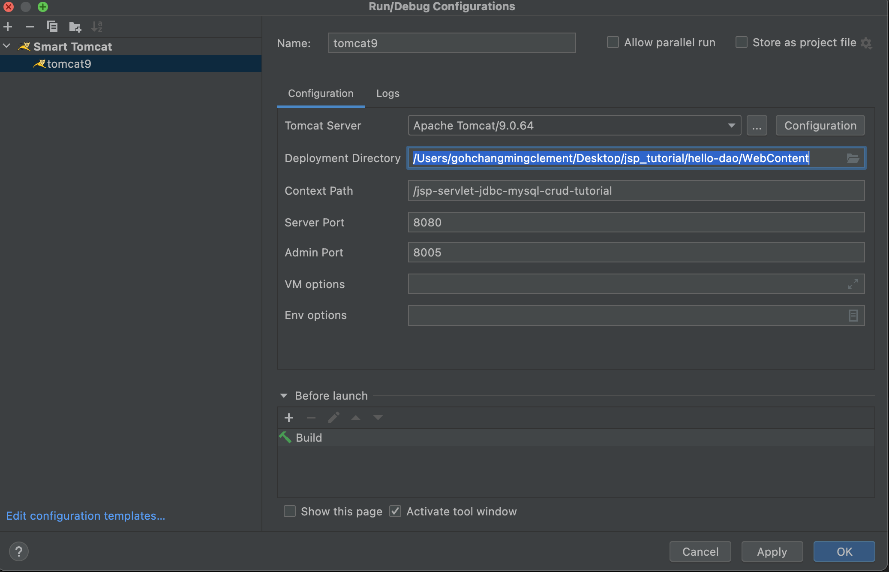
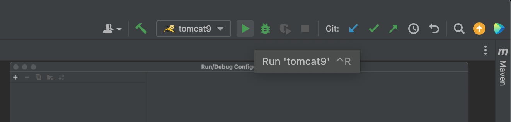
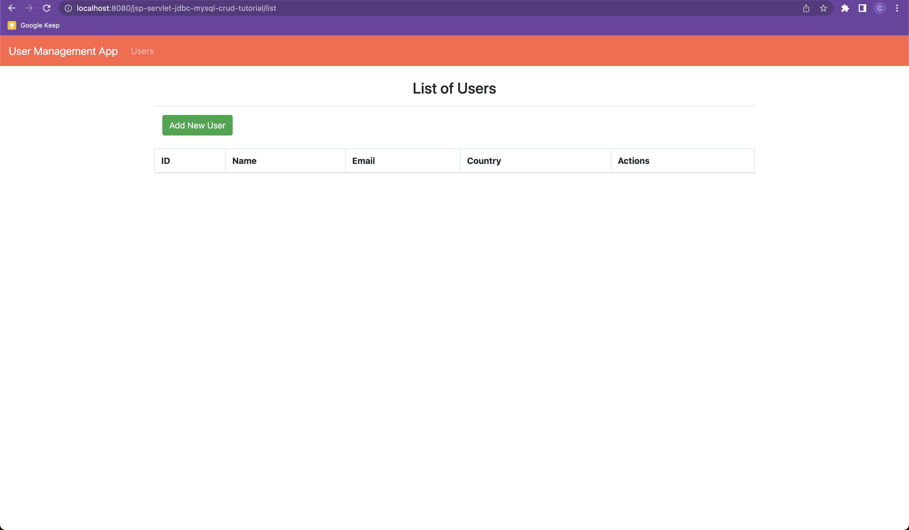

# JSP Servlet Tutorial - Exploring the DAO pattern with Java Servlet Pages and MySQL

JSP Servlet JDBC MySQL CRUD Example Tutorial
Source: https://www.javaguides.net/2019/03/jsp-servlet-jdbc-mysql-crud-example-tutorial.html

# Prerequisites

1. IntelliJ IDEA - IDE
2. Maven - Manage Dependencies
3. MySQL - Local Instance, to persist data
4. Apache Tomcat 9
5. Java 8 and above

# Setup

## 1. Clone Repository.

```
git clone git@github.com:clementgohchangming/hello-dao.git
```

## 2. Spin up MySQL local instance

### MacOS

https://flaviocopes.com/mysql-how-to-install/

### Windows

https://www.mysqltutorial.org/install-mysql/

## 3. Setup a MySQL user with the following username / password.

In `src.main.java.net.javaguides.usermanagement.dao.UserDAO.java`, we defined the dummy mysql username / password as the following:

```
// Note, allowPublicKeyRetrieval allows malicious proxies to encode fake messages with your public key and perform man in the middle attacks. we are enabling it here and making it unsafe, only for testing
private String jdbcURL = "jdbc:mysql://localhost:3306/demo?allowPublicKeyRetrieval=true&useSSL=false";
private String jdbcUsername = "root";
private String jdbcPassword = "!@#$password!@#$";
```

You can either 

1. setup your mysql user to have the following username or password
2. change `UserDAO.java`'s `jdbcUsername` and `jdbcPassword` to your corresponding username / password

To change your mysql user password to `!@#$password!@#$`

```
MacBook-Pro-2:jsp_tutorial gohchangmingclement$ mysql -u root -p
Enter password: 
Welcome to the MySQL monitor.  Commands end with ; or \g.
Your MySQL connection id is 26
Server version: 8.0.29 Homebrew

ALTER USER 'root'@'localhost' IDENTIFIED BY '!@#$password!@#$';
```

if you encounter invalid password error when setting password, check your mysql password security settings

```
mysql> SHOW VARIABLES LIKE 'validate_password.%';
+--------------------------------------+-------+
| Variable_name                        | Value |
+--------------------------------------+-------+
| validate_password.check_user_name    | ON    |
| validate_password.dictionary_file    |       |
| validate_password.length             | 4     |
| validate_password.mixed_case_count   | 0     |
| validate_password.number_count       | 0     |
| validate_password.policy             | LOW   |
| validate_password.special_char_count | 0     |
+--------------------------------------+-------+
```

set them to the following settings above for allowing a loose password for testing 

E.G
```
SET GLOBAL validate_password.length = 4;
```

Source: 

- https://stackoverflow.com/questions/43094726/your-password-does-not-satisfy-the-current-policy-requirements

## 4. Download Runtime - Apache Tomcat 9

Unfortunately, as of June 27 2022, this project is not compatible for running it on Apache Tomcat 10.

Apache Tomcat 10 uses `jakarta.servlet`, instead of `javax.servlet`, and this project was configured to use `javax.servlet`.

Simply changing the dependencies in maven `pom.xml` to use `jakarta.servlet` won't cut it for now. We will cover the migration at another time.

For now, use Apache Tomcat 9 so we can continue using `javax.servlet` for our java servlet pages demo.

To install Apache Tomcat 9 on your computer (mac or windows):

- https://tomcat.apache.org/download-90.cgi

MacOS Guide

- https://medium.com/@fahimhossain_16989/installing-apache-tomcat-on-macos-mojave-using-homebrew-28ce039b4b2e

Windows Guide

- https://phoenixnap.com/kb/install-tomcat-windows

## 5. Setup IntelliJ to use Apache Tomcat 9 in Run Configurations

Now, we will setup IntelliJ to point to Apache Tomcat 9 in our run configurations, so we can run up the JSP application with it as our runtime.

1. Click IntelliJ Idea -> Preferences -> Plugins -> Marketplace 



2. Search for the Smart Tomcat plugin, and install it. We will be using this plugin in our Run Configurations.



3. Open up Run Configurations at the top right corner of your IDE



4. Create a new Run Configuration with Smart Tomcat.



5. Point Tomcat Server to where we installed Apache Tomcat 9





6. Select deployment directory to where you cloned the directory. Apply run configuration



## 6. Maven Compile to download dependencies for project, and compile project to executable bytecode.

```
MacBook-Pro-2:hello-dao gohchangmingclement$ mvn compile
```

## 7. Click Run on IntelliJ with your new run configuration



## 8. We are done!


